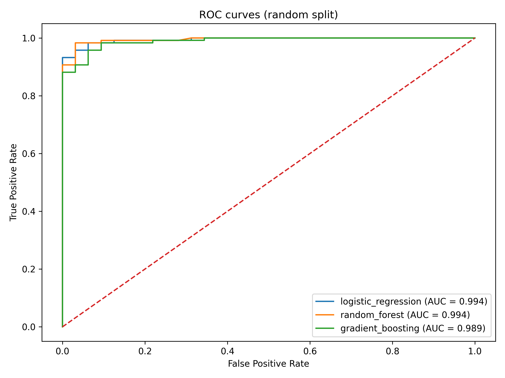
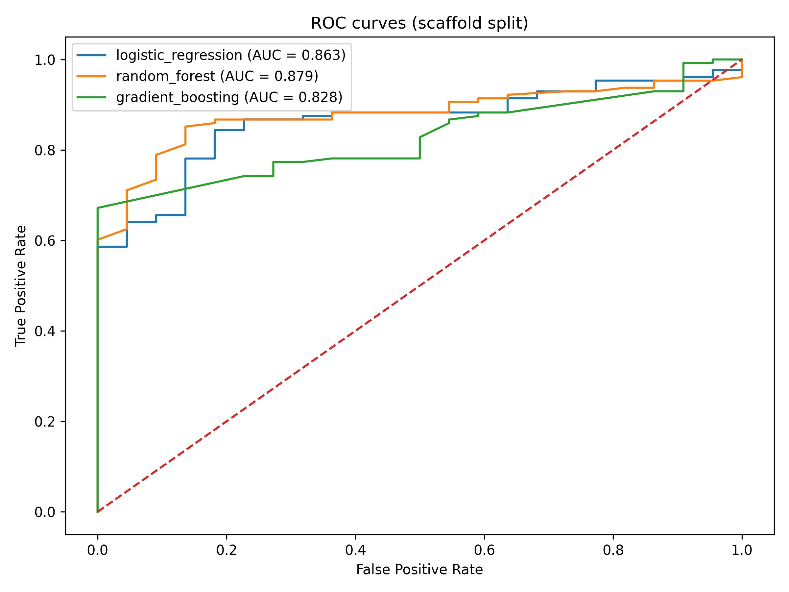
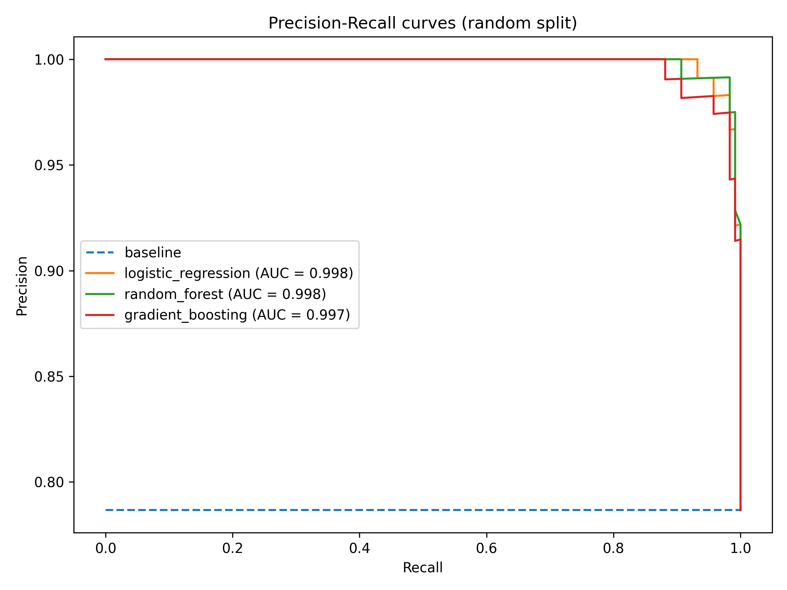
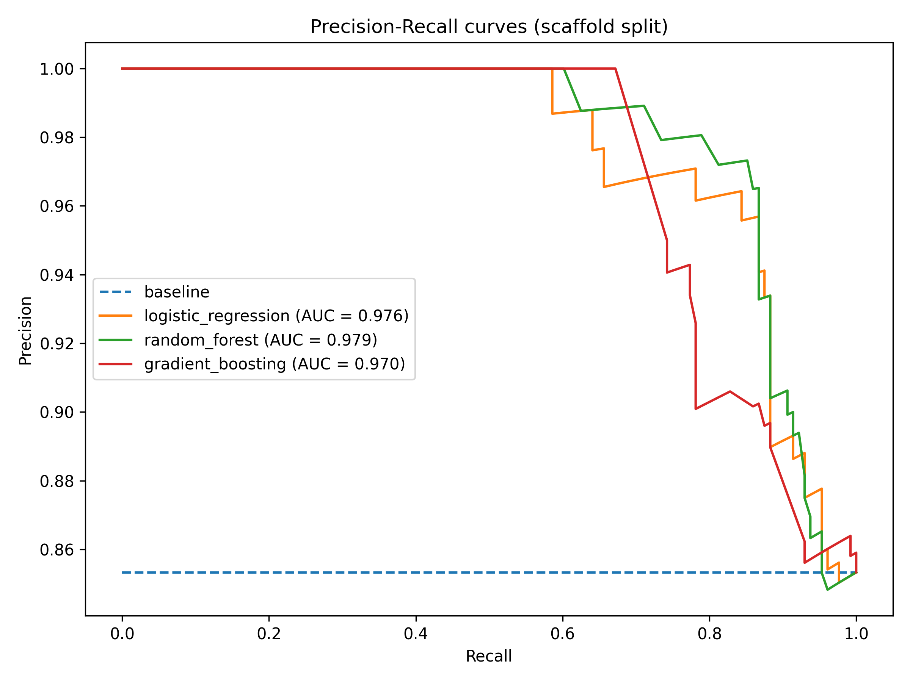
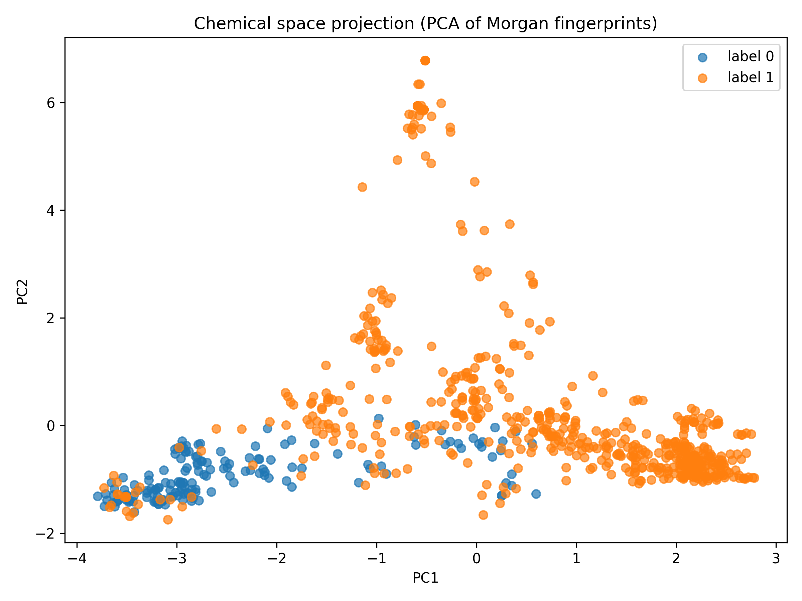
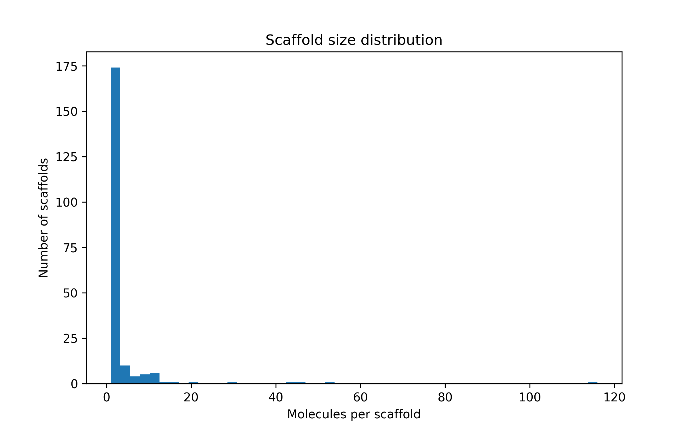

# BindingDB Activity Prediction

A reproducible machine learning pipeline for predicting molecular activity from chemical structure using BindingDB data.

This project demonstrates how to build a clean and scientifically responsible molecular ML workflow, from raw biochemical data to evaluated predictive models.

The focus is not on complex models, but on **data quality, reproducibility, and realistic evaluation strategies** for cheminformatics tasks.

---

# Project Overview

Drug discovery datasets often contain many structurally related molecules.  
Naive evaluation strategies can therefore overestimate model performance.

This project builds a pipeline that:

- processes BindingDB data
- constructs a clean EGFR activity dataset
- featurizes molecules from SMILES
- trains baseline machine learning models
- evaluates models using both **random splits and scaffold splits**
- visualizes chemical space and model performance

The repository is designed to resemble a **small research-grade ML package**, not a collection of notebooks.

---

# Dataset

The dataset is derived from **BindingDB**, a public database of experimentally measured protein–ligand binding affinities.

Target used in this project:

EGFR (Epidermal Growth Factor Receptor)

Processing steps:

1. Filter entries for the EGFR target  
2. Canonicalize SMILES using RDKit  
3. Aggregate affinity measurements  
4. Convert affinity values into binary activity labels  

Labeling scheme:

Active: affinity ≤ 1000 nM  
Inactive: affinity ≥ 10000 nM  

Ambiguous values are removed.

Final dataset statistics:

Total molecules: 750  
Unique scaffolds: 207  
Largest scaffold family: ~15% of dataset  

---

# Pipeline

```
BindingDB raw data
        │
        ▼
dataset cleaning
        │
        ▼
SMILES canonicalization
        │
        ▼
Morgan fingerprint featurization
        │
        ▼
dataset splitting
        │
        ▼
model training
        │
        ▼
evaluation and visualization
```

---

# Molecular Representation

Molecules are encoded using **Morgan fingerprints** (circular fingerprints) generated with RDKit.

Configuration:

radius = 2  
n_bits = 2048  

These fingerprints capture local chemical environments around atoms and are widely used in cheminformatics.

---

# Models

The project implements simple but strong baseline models.

| Model | Type |
|------|------|
| Logistic Regression | Linear classifier |
| Random Forest | Nonlinear ensemble |
| Gradient Boosting | Boosted decision trees |

The goal is to establish a **reliable baseline benchmark** before introducing more complex models.

---

# Evaluation Strategy

Two dataset splitting strategies are compared.

## Random Split

Randomly splits molecules into training and test sets.

Train and test often contain structurally similar molecules.

This typically produces **optimistic performance estimates**.

---

## Scaffold Split

Uses **Bemis–Murcko scaffolds** to separate chemical families.

Train and test sets contain **different molecular scaffolds**.

This provides a more realistic evaluation of model generalization to new chemotypes.

---

# Results

## ROC Curves

### Random Split



### Scaffold Split



Random split performance is near-perfect due to structural similarity between train and test molecules.

Scaffold split provides a more challenging and realistic benchmark.

---

## Precision–Recall Curves

### Random Split



### Scaffold Split



---

# Chemical Space Visualization

Principal Component Analysis (PCA) was applied to Morgan fingerprints to visualize the distribution of molecules in chemical space.



Observations:

- active molecules occupy a broader region of chemical space
- inactive molecules cluster more tightly
- there is partial overlap between the two classes

---

# Scaffold Analysis

The dataset contains many scaffold families with uneven sizes.

Example statistics:

Average scaffold size: 3.62  
Median scaffold size: 1  
Largest scaffold fraction: 0.155  

Scaffold distribution:



---

# Repository Structure

```
bindingdb-activity-prediction
│
├── configs
├── data
│   ├── raw
│   └── processed
│
├── notebooks
│
├── results
│   ├── figures
│   └── metrics
│
├── scripts
│   ├── build_egfr_dataset.py
│   ├── train.py
│   ├── compare_models.py
│   ├── analyze_scaffold.py
│
└── src/bindingdb_activity_prediction
    ├── data.py
    ├── dataset.py
    ├── evaluation.py
    ├── featurization.py
    ├── models.py
    ├── plotting.py
    └── splits.py
```

The codebase separates:

- reusable logic (`src`)
- experiments (`scripts`)
- outputs (`results`)

---

# Reproducibility

Install the project locally:

```
pip install -e .
```

Example run:

```
python scripts/train.py
```

Plots and metrics can be regenerated using the scripts provided in the repository.

---

# Limitations

This project intentionally focuses on baseline methodology.

Current limitations include:

- single protein target (EGFR)
- relatively small dataset
- Morgan fingerprints only
- limited hyperparameter tuning
- classical ML models only
- no uncertainty estimation

---

# Future Work

Possible extensions include:

- RDKit molecular descriptor representation
- scaffold-aware cross-validation
- feature importance analysis
- uncertainty estimation via bootstrapping
- graph neural network models
- multi-target modeling
- model explainability (SHAP)

---

# Project Goal

This repository demonstrates how to build a **clean, reproducible molecular ML pipeline** that emphasizes:

- scientific rigor  
- realistic evaluation strategies  
- interpretable baseline models  

rather than simply maximizing predictive performance.
---

# Author

Gian Marco Tuveri  
Computational Biophysics — Molecular Modeling & Machine Learning
